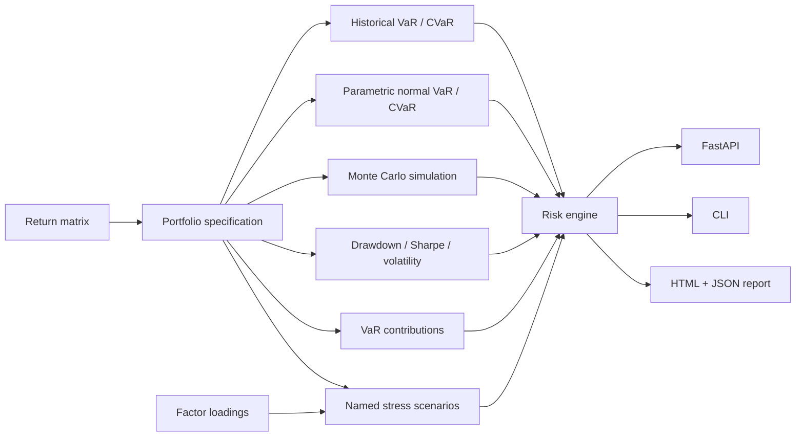

# Portfolio Risk Engine

A production-shaped quantitative risk reference project implementing **historical, parametric and Monte Carlo VaR/CVaR**, drawdown analysis, component risk decomposition and named factor stress scenarios behind both CLI and FastAPI interfaces.

The repository uses deterministic synthetic returns so it remains reproducible and safe to publish. It is a portfolio/engineering project, not investment advice and not a claim of production risk-model validation.

## Architecture



## Implemented analytics

- normalized portfolio weights;
- portfolio return series and covariance-driven Monte Carlo draws;
- **historical VaR and Expected Shortfall / CVaR**;
- **Gaussian parametric VaR/CVaR** with configurable confidence;
- **Monte Carlo VaR/CVaR** with deterministic seeds;
- annualized return and volatility;
- maximum drawdown and simple Sharpe ratio (`rf=0` for the demo);
- finite-difference historical-VaR contribution decomposition;
- factor-loading stress tests for risk-off, inflation and liquidity shocks.

The point of implementing three VaR methods side by side is not to pretend one is universally correct. It makes distributional assumptions and model risk visible: historical VaR depends on the observed sample, parametric VaR assumes a normal approximation, and Monte Carlo depends on the estimated joint return distribution.

## Quick start

```bash
python -m venv .venv
source .venv/bin/activate  # Windows: .venv\Scripts\activate
pip install -r requirements.txt
python -m src.cli --confidence 0.95 --mc-scenarios 30000
```

Artifacts:

```text
artifacts/risk.json
artifacts/risk.html
```

## API

```bash
uvicorn app.api:app --reload
curl http://localhost:8000/demo
```

`POST /risk` accepts an asset list, weights and optionally a custom return matrix. If no matrix is supplied, the service uses the deterministic synthetic market generator.

## Synthetic market generator

`src/synthetic.py` creates five correlated return streams:

```text
global_equity
tech_equity
investment_grade
gold
usd_index
```

The generator includes a short stress window so drawdown behavior is visible without downloading market data during CI.

## Stress model

The repository includes explicit factor loadings for the synthetic assets and three named scenarios:

- `global_risk_off`
- `inflation_shock`
- `liquidity_squeeze`

Each scenario is a vector of shocks to equity, rates, credit, commodity and FX factors. The engine maps those shocks through asset loadings and reports per-asset contribution plus total portfolio impact.

## Run with Docker

```bash
docker build -t portfolio-risk-engine .
docker run --rm -p 8000:8000 portfolio-risk-engine
```

## Tests and CI

```bash
ruff check .
pytest -q
```

GitHub Actions also runs a reduced Monte Carlo demo and builds the API container.

## Interview topics this repository supports

- VaR vs Expected Shortfall;
- historical vs parametric vs Monte Carlo approaches;
- why diversification depends on covariance rather than asset count;
- component / marginal risk contribution;
- model-risk assumptions and tail limitations;
- scenario analysis vs probabilistic VaR;
- drawdown versus volatility;
- deterministic simulations and reproducibility;
- exposing quantitative analytics behind an API without hiding the underlying math.

## Portfolio signal

**Python · NumPy · Pandas · Monte Carlo · VaR/CVaR · covariance · stress testing · risk attribution · FastAPI · Docker · CI/CD**
